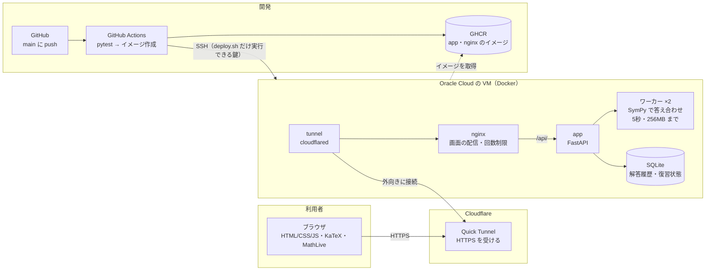
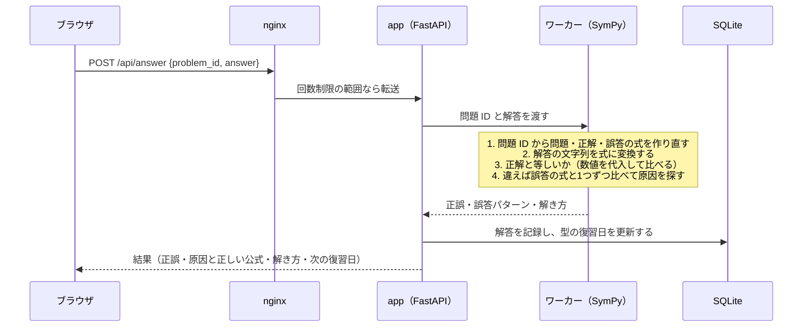

# 数学ドリル — 類題自動生成＋誤答パターン診断

[](https://github.com/IkuF0906/kip-2026/actions/workflows/ci.yml)

微分・積分・極限に加えて数列・場合の数と確率の練習問題を自動で作り、間違えたときに「なぜ間違えたか」を指摘する Web アプリです。
AI・LLM の API は使わず、数式処理（SymPy）とルールだけで動きます。

## 特徴

- **問題の入力が不要**：7単元・41種類の問題の型（ひな形）から、係数や関数を変えた類題を無限に作ります。
  計算問題だけでなく、箱の容積の最大化・囲まれた部分の面積・貯金・くじ引きなどの文章題もあります。
- **誤答パターン診断**：「積の微分を u'v' にした」「積分で中身の係数で割り忘れた」「0/0 を 0 とした」など、
  よくある間違い90種類を式として用意し、解答と一致すれば原因と正しい公式を表示します。
- **形が違っても正しく判定**：答えを展開・因数分解した形で書いても、数式として等しければ正解にします。
  不定積分は積分定数の違いを無視して判定し、$+C$ を書き忘れたときは注意を表示します。
- **間違えた型を優先して復習**：型ごとにライトナー方式（間隔反復）で次の復習日を決め、
  「復習」タブでは選んだ単元の中から、期限が来た型・苦手な型を出題します。
- **ノート**：手書き（ペン・消しゴム）と途中式メモで、紙を使わずに計算できます。
- **成績画面**：解いた数・正答率・いま復習する型の数と、つまずいている型、単元ごとの習熟度・多い間違いを確認できます。

## システムの全体像

### 構成

利用者のブラウザから本番の VM までと、開発者の push から本番に反映されるまでの流れです。



| 層 | 使っているもの | 役割 |
|---|---|---|
| 画面 | HTML/CSS/JavaScript（ビルドなし）、KaTeX、MathLive | 問題と数式の表示、解答の入力（数式エディタ・入力キー・テキスト）、手書きノート、成績の表示 |
| 配信 | nginx、Cloudflare Tunnel | 画面のファイルを直接返し、`/api/` だけをアプリに渡す。1つの IP から API に送れる回数を制限する。VM はポートを開けず、外への接続だけで公開する |
| アプリ | FastAPI | 出題・答え合わせ・復習の順番・成績の API。利用者は Cookie の ID で区別する |
| 数式処理 | SymPy（別プロセスのワーカー） | 解答の読み取り、正解・誤答の式との比較。重い式で止まらないよう、時間とメモリに上限を付ける |
| 保存 | SQLite（Docker のボリューム） | 解答履歴と、型ごとの復習状態（ライトナー方式の箱と次の復習日） |
| CI/CD | GitHub Actions、GHCR | push のたびにテストし、通れば amd64・arm64 のイメージを作って VM の版を入れ替える |

### 答え合わせの流れ

解答を送ってから結果が出るまでに、サーバーの中で行うことです。問題は保存せず、問題 ID（`<型>-<シード>`）から毎回作り直します。



5秒で終わらない式（`9^9^9^9` など）はワーカーごと止めて作り直し、「式の計算が終わりませんでした」と返します。

### 学習の流れ

1. **練習**：単元と問題の型を選んで解く。型を選ばなければ、単元の中からランダムに出す
2. **答え合わせ**：正解なら次へ。不正解なら、当てはまる誤答パターンの原因と正しい公式、解き方の手順を出す
3. **復習の予定**：型ごとに、正解すると次の復習が 1・2・4・8 日後と延び、間違えるとすぐに戻る
4. **復習**：期限が来た型・まだ解いていない型・苦手な型の順に自動で出す
5. **成績**：つまずいている型と多い間違いを確かめ、その型の練習に戻る

## 単元と問題の型

| 単元 | 型 | 主な誤答パターン |
|---|---|---|
| 微分 | 多項式 | 指数を前に出し忘れ／指数を減らし忘れ／定数項を残す |
| | 負・分数の指数 | 指数を1増やす／分母だけ微分する |
| | 積の微分 | $u'v'$ にする／片方の項が抜ける／引き算にする |
| | 商の微分 | 分子の順序が逆／分母の2乗を忘れる／$\frac{u'}{v'}$ にする |
| | 合成関数の微分 | 内側の微分を掛け忘れ／cos の符号ミス／$\sqrt{\ }$ の $\frac{1}{2}$ を忘れる |
| | 三角関数 | cos の符号ミス／sin・cos の符号を逆に覚えている |
| | 指数・対数関数 | $\ln a$ を掛け忘れ／べき関数の公式を使う |
| | 積＋合成関数 | 上記の組み合わせ |
| 不定積分 | 多項式 | 指数を増やしたが割り忘れ／元の指数で割る／定数項を積分し忘れ／微分してしまう |
| | 負・分数の指数 | 割り忘れ／元の指数で割る |
| | 三角関数 | 符号を逆にする／中身の係数で割り忘れ・掛けてしまう |
| | 指数・対数関数 | 中身の係数で割り忘れ／$a^x$ で $\ln a$ で割り忘れ |
| | 1次式の合成 $(kx+b)^n$ | 中身の係数で割り忘れ・掛けてしまう |
| | 部分積分 | 符号ミス／後ろの項を忘れる／積の積分を積分の積にする |
| 定積分 | 多項式・三角関数・指数・対数関数 | 上端と下端の引き算が逆／下端の値を引き忘れ／原始関数を求めずに代入 |
| | 囲まれた部分の面積（文章題） | 上下を逆にして引く／直線を引き忘れる／$\frac{1}{6}$ 公式で係数を掛け忘れ |
| | 速度と道のり（文章題） | 道のりではなく位置の変化を答える |
| 極限 | 分数式（$x \to \infty$） | 次数が違うのに係数の比を答える／$\frac{\infty}{\infty} = 1$ とする |
| | $\frac{0}{0}$ の約分 | $\frac{0}{0}$ を 0 や 1 とする／因数分解の符号ミス |
| | $\frac{\sin x}{x}$ の極限 | 係数を無視して 1 とする／比が逆 |
| | $e$ の定義 | $1^\infty = 1$ とする／$e$ の指数を付け忘れ |
| | $\infty - \infty$ の有理化 | 0 とする／有理化後の分母の扱いを間違える |
| 微分の応用 | 接線・法線の方程式 | 傾きに $f'(x)$ を使う／$(x-a)$ の符号ミス／法線の傾きの逆数・マイナス忘れ |
| | 極大値・極小値 | 極大と極小の取り違え／$x$ の値を答える |
| | 最大・最小（文章題：箱の容積） | 切り取る正方形が両端にあることを忘れる／$x$ の値を答える |
| 数列 | 等差数列の一般項 | 公差を $n$ 回足す／公差を求めるとき項の番号の差で割り忘れ |
| | 等差数列・等比数列の和（文章題） | 2 で割り忘れ／$r^{n-1}$ を使う／$r-1$ で割り忘れ／第 $n$ 項を答える |
| | $\sum$ の計算 | $\sum c = c$ とする／$\sum k^2 = (\sum k)^2$ とする |
| | 階差数列・漸化式 $a_{n+1} = pa_n + q$ | 和を $k = n$ まで取る／初項を足し忘れ／$p^n$ にする／$\alpha$ の符号ミス |
| 場合の数・確率 | 順列と組合せ・いろいろな並べ方 | 順列と組合せの取り違え／円順列・同じものを含む順列で割り忘れ／隣り合う 2 人の入れ替えを忘れる |
| | 余事象・反復試行 | 1 から引き忘れ／確率を回数分足す／${}_n\mathrm{C}_k$ や $(1-p)^{n-k}$ の掛け忘れ |
| | 玉を戻さずに取り出す・条件付き確率・期待値（文章題） | 戻すとして計算／順番の片方だけ数える／$P(A \cap B)$ を答える／賞金を単純に平均する |

## 使い方

Python 3.10 以上が必要です。

```sh
python -m venv .venv
# Windows
.venv\Scripts\activate
# macOS / Linux
source .venv/bin/activate

pip install -r requirements-dev.txt
uvicorn drill.api:app --reload
```

ブラウザで http://localhost:8000 を開き、上の「単元」と「問題の型」で出題範囲を選びます。

- 解答は数式エディタ（MathLive）で入力します。分数・累乗・関数・$\pi$・$\infty$・積分定数 $C$ などは、解答欄の下のキーからも入力できます。
  キーボードでの入力方法は、キーの右下にある「入力方法」ボタンから確認できます。
- 「テキストで入力する」に切り替えると `3x^2 + 2sin(x)` のような文字でも入力でき、入力中の式がどう読み取られるかが表示されます。
  $\infty$ は `oo`、積分定数は `C` と書きます。数列の単元では `x` の代わりに `n` を使います（入力キーの $x$ も $n$ に変わります）。`y = 2x + 1` のように左辺から書いても、右辺だけが使われます。
- 解答履歴は `drill.db`（SQLite）に保存されます。保存先は環境変数 `DRILL_DB` で変えられます。
- 解答履歴と復習スケジュールは、ブラウザごとに Cookie（`drill_uid`）で発行する ID で分けて保存します。
  利用者を分ける前の `drill.db` は、起動時に ID `local` の履歴として移されます。
  これを今のブラウザに引き継ぐには、一度だけ環境変数 `DRILL_ADOPT_LOCAL=1` を付けて起動し、ページを開きます
  （このとき Cookie のないブラウザはすべて `local` になります）。

### Docker で動かす

```sh
docker compose up -d           # GitHub Container Registry（GHCR）に置いたイメージで動かす
docker compose up -d --build   # 手元のコードからイメージを作って動かす
```

http://localhost:8080 で開けます。次の2つのコンテナで動きます。

| コンテナ | 内容 |
|---|---|
| `nginx` | 画面（static/）を直接配信し、`/api/` をアプリに転送する。1つの IP から API に送れる回数を毎秒5回（一時的に20回まで）に制限する |
| `app` | FastAPI のアプリ（`Dockerfile`）。DB は名前付きボリューム `drill-data` に保存するので、コンテナを作り直しても履歴は残る |

nginx の設定は `deploy/nginx/` にあります。止めるときは `docker compose down` です（`-v` を付けると履歴も消えます）。

#### インターネットに公開する（Cloudflare Tunnel）

```sh
docker compose --profile tunnel up -d --build
docker compose logs tunnel   # https://xxxx.trycloudflare.com の URL が出る
```

`tunnel` コンテナ（cloudflared）が Cloudflare へ外向きに接続し、届いたアクセスを nginx に渡します。
ルーターのポートを開ける必要はなく、HTTPS も Cloudflare が受け持ちます。
アカウントのいらない Quick Tunnel なので、起動するたびに URL が変わり、PC を付けている間だけ公開されます。
公開をやめるときは `docker compose --profile tunnel stop tunnel` です。

- nginx は Cloudflare が付ける `CF-Connecting-IP` を送信元の IP として扱い、回数制限やログに使います。
- HTTPS で開いたときは、Cookie に `Secure` を付けます。

#### main への push で自動で更新する（Watchtower）

```sh
docker compose --profile tunnel --profile autodeploy up -d
```

1. main に push すると、GitHub Actions（`.github/workflows/ci.yml`）がテストを実行する
2. テストが通ったら、`app`・`nginx` のイメージを作り、GHCR に `latest` とコミットのハッシュの2つのタグで置く
3. `watchtower` コンテナが1分ごとに GHCR を見て、新しい `latest` があれば `app`・`nginx` のコンテナを作り直す

動かしている PC から GHCR を見に行く方式（pull 型）なので、外から PC に入る経路を開ける必要がありません。
前の版に戻すときは、`compose.yaml` のタグをコミットのハッシュに変えて `docker compose up -d` します。

### Oracle Cloud の VM で動かす（本番）

Oracle Cloud の Always Free の VM（VM.Standard.E2.1.Micro、Ubuntu 24.04、メモリ 1GB）で、PC を付けていなくても公開し続けます。
main に push すると、GitHub Actions がテスト・イメージ作成のあと、VM に SSH で入ってそのコミットの版に入れ替えます（push 型）。

```
push → pytest → イメージを GHCR に置く（amd64・arm64） → SSH で VM の deploy.sh を実行
                                                          ├ そのコミットの deploy/compose.prod.yaml を取得
                                                          ├ IMAGE_TAG=<コミット> でイメージを取得して入れ替え
                                                          └ /api/version が新しい版を返すまで待つ
```

| ファイル | 内容 |
|---|---|
| `deploy/compose.prod.yaml` | VM での構成（app・nginx・tunnel）。nginx は VM の localhost にだけ開ける |
| `deploy/vm/setup.sh` | VM を最初に整える手順（スワップ 2GB、Docker、ログの大きさの制限、デプロイ用の鍵の登録） |
| `deploy/vm/deploy.sh` | Actions が SSH で呼ぶデプロイ用スクリプト |

- **ポートを開けない**：VM のファイアウォールは SSH（22番）以外の受信を拒否したままで、公開は Cloudflare Tunnel 経由だけです。
- **SSH を守る**：パスワードでのログインは無効で、鍵がなければ入れません。総当たりの試みが絶えず来るので、
  fail2ban で10分に5回失敗した IP を1時間遮断します。
- **デプロイ用の鍵を制限する**：Actions が使う鍵は、VM の `authorized_keys` で `command="/opt/drill/deploy.sh",restrict` を付けて登録しています。
  鍵が漏れても、送れるのはコミットのハッシュだけで、ほかのコマンドは実行できません。
  `deploy.sh` は、そのハッシュが main に含まれるかを GitHub の API で確かめます（フォークのコミットで動かされないため）。
- **秘密鍵を main からだけ使う**：秘密鍵は GitHub の environment `production` の Secret にあり、この environment は main からしか使えません。
- **なりすましを防ぐ**：VM のホスト鍵を Variable `DEPLOY_KNOWN_HOSTS` に登録し、Actions はそれと一致するときだけ接続します。
- **前の版に戻す**：GitHub の Actions の画面で前のコミットの実行を「Re-run」するか、VM で `/opt/drill/deploy.sh <コミット>` を実行します。

GitHub に登録してあるもの：environment `production` の Secret `DEPLOY_SSH_KEY`（デプロイ用の秘密鍵）、Variable `DEPLOY_HOST`（VM の IP アドレス）・`DEPLOY_KNOWN_HOSTS`。
公開 URL は、VM で `docker compose -f /opt/drill/compose.yaml logs tunnel` を実行すると確認できます（VM を再起動すると変わります）。

### テスト

```sh
pytest
```

全ての型を多数のシードで生成し、次のことを確かめています。
- 正解が、単元の定義から求め直した答えと一致すること（微分・積分は SymPy で計算し直し、極限は左右からの極限も確かめる）
- 各誤答パターンの式が、その原因として診断されること
- 正解と誤答、誤答どうしが同じ式にならないこと

main への push とプルリクエストのたびに、GitHub Actions が Python 3.10 と 3.12 でテストを実行します（`.github/workflows/ci.yml`）。

### 評価

```sh
python -m scripts.evaluate 200
```

型ごとに、正解・誤答の判定率、1問あたりの診断できる誤答パターン数、処理時間を測ります。
結果は [docs/evaluation.md](docs/evaluation.md) にまとめています。

### 画面の確認

```sh
python -m scripts.screenshot
```

インストール済みの Chrome を Playwright で操作し、主な画面（問題・ノート・答え合わせ・入力方法・成績・単元ごとの問題、スマホの幅での表示）の
スクリーンショットを `screenshots/` に保存します。一時的な DB を使う専用のサーバーを起動するので、普段の解答履歴には影響しません。

## 仕組み

```
drill/
  core.py        単元・問題の型・誤答パターンのデータ構造と共通の補助関数
  units/         単元ごとの問題の型と誤答パターン（derivative / integral / definite / limit / application / sequence / probability）
  templates.py   全単元をまとめ、問題 ID から問題を生成する
  checker.py     解答の文字列を SymPy の式に変換し、数式として等しいかを判定する
  diagnosis.py   解答を正解・誤答の式と照合する
  grading.py     解答の読み取りと答え合わせ（ワーカーで動かす処理）
  sandbox.py     答え合わせを別のプロセスで、時間とメモリに上限を付けて動かす
  scheduler.py   型ごとの復習スケジュール（ライトナー方式）
  db.py          解答履歴と復習状態の保存（SQLite）
  api.py         Web API（FastAPI）と画面の配信
deploy/          デプロイ用の設定（nginx、Oracle Cloud の VM）
static/          画面（HTML/CSS/JavaScript、KaTeX・MathLive は CDN から読み込み）
tests/           pytest
scripts/         評価・画面確認のスクリプト
docs/            評価結果
```

- **問題の生成**：問題 ID は `<型>-<シード>` で、同じ ID からは常に同じ問題が作られます。
  そのため問題自体を保存する必要がありません。
- **単元**：問題文、解答欄の左の表示（`f'(x) =`、`y =` など）、正解の判定方法、解答に使う変数（`x` か `n`）を単元ごとに持ちます。
  文章題は問題文に状況を書き、式の欄を出しません。
  単元を足すときは `drill/units/` にファイルを1つ追加し、`templates.py` に登録します。
- **誤答の照合**：各型が「その間違いをしたら出てくる答え」を式として作っておきます。
  利用者の解答が正解と等しくなければ、誤答の式と1つずつ比べて原因を特定します。
  係数の組み合わせによって誤答が正解と同じ式になる場合（例：$x^1$ で「指数を減らし忘れ」）は、診断の候補から外します。
- **等価判定**：x に複数の値を代入して数値で比べ、評価できない場合だけ記号的に簡約して比べます。
  不定積分は両方を微分してから比べ（積分定数の違いを無視）、$\pm\infty$ はそのまま比べます。
  数列の答え（$n$ の式）も同じように $n$ に値を代入して比べます。
- **重い解答への備え**：`9^9^9^9` のような解答は SymPy の計算が終わらず、メモリも使い切ります。
  そこで答え合わせは別のプロセス（ワーカー、既定で2つ）で動かし、5秒で終わらなければワーカーを止めて作り直します。
  Linux ではワーカーのメモリも上限（Docker では 256MB）を超えると打ち切ります。解答は300文字までです。
  設定は環境変数 `DRILL_WORKERS`・`DRILL_TIMEOUT`・`DRILL_WORKER_MEMORY_MB` で変えられます。

## API

| メソッド | パス | 内容 |
|---|---|---|
| GET | `/api/version` | 動いている版（Docker のイメージを作ったコミットのハッシュ。Docker の外では `dev`） |
| GET | `/api/units` | 単元の一覧 |
| GET | `/api/types?unit=<単元>` | 問題の型の一覧（単元を省略すると全単元） |
| GET | `/api/problem?type=<型>` または `?unit=<単元>` | 新しい問題（型を省略すると、単元の中からランダム） |
| GET | `/api/review?unit=<単元>` | 復習スケジュールに基づく次の問題（単元を省略すると全単元から） |
| POST | `/api/answer` | `{problem_id, answer}` を送ると正誤・診断・注意・解き方を返す |
| GET | `/api/preview?text=<解答>` | テキストの解答がどの式として読み取られるか |
| GET | `/api/stats` | 単元・型ごとの正答率・習熟度・多い間違い |

## 今後の予定

- 実際の学習者の間違いのうち、何割が誤答パターンに当てはまるかの調査
- **別ツール（余裕があれば）：PC 作業の効率化ツール**
  - 講義資料の自動仕分け：ダウンロードした資料を、時間割とファイル名から科目フォルダへ自動で移動・リネームする
  - 作業モード切替：「レポート」「プログラミング」などのモードごとに、アプリ・フォルダ・タブを一括で開いてウィンドウを配置する
